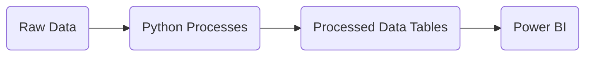

# ACWA

Test

Project for ACWA dashboard.

This repository contains the code that process raw input data into the transformed data tables that will be visualized into a PowerBi dashboard



## Requirements

- [Python (>3.11)](https://www.python.org/)
- [Git](https://git-scm.com/)
- [Poetry](https://python-poetry.org/)

## Set-Up

This repository's origin is located at GENER-Circe organization. Ask for permission to access this repository.

Clone the repository by running this command from git bash:

```bash
git clone https://github.com/GENER-Circe/ACWA.git
```

It might ask for your github user credentials.

## Environment and package installation

We use poetry for the management of package dependencies. 

It is recommended to establish the virtual environment inside the project (although this is not mandatory). To do that, you can change poetry configuration:

```
poetry config virtualenvs.in-project true
```

The repository should contain a poetry.lock file, that specifies the versions of the required packages. To install them:

```bash
poetry install
```

To run the code from this repository, you'll need to activate the environment:

```bash
poetry shell
```

After this command, you'll have your environment activated, and you can run every Python script normally.

## Documentation

We use [MkDocs](https://www.mkdocs.org/) to organize documentation. The necessary packages to run the documentation are configured inside an optional group of dependencies, called docs, that is not installed by default. If you want to consult the documentation, make sure to install this group:

```bash
poetry install --with-docs
```

To see the documentation, run the following command:

```bash
mkdocs serve
```

Then, open the browser and go to https://localhost:8000. You can also build the documentation to be shared without the rest of the repository:

```bash
mkdocs build
```

This command will create a folder named site, that contains html files that can be explored locally. The content and appearence should be very similar but some features like the search plugin won't work.

## Azure Resources

### Azure DevOps

We use a secondary repository in Azure DevOps: https://gener-circe@dev.azure.com/gener-circe/acwa/_git/acwa

To configure this secondary repository, that we'll call cloud:

```
git remote add cloud https://gener-circe@dev.azure.com/gener-circe/acwa/_git/acwa
```

At .git/config make sure that the main and develop branches have the remote origin. Thus, by default we will pull/push to origin (i.e. GitHub)

To specifically push to the cloud remote:

```
git push cloud
```

### Steps for deployment

1. Make sure that config/main is in 'cloud'
2. Update wod package and copy wheel
3. Update acwa package and copy wheel
4. Restart function app (just in case)
5. Select resource AWCA (up-center) and press "Deploy" in pop-up message


### Update the database

Run the script src/update_local.py
    