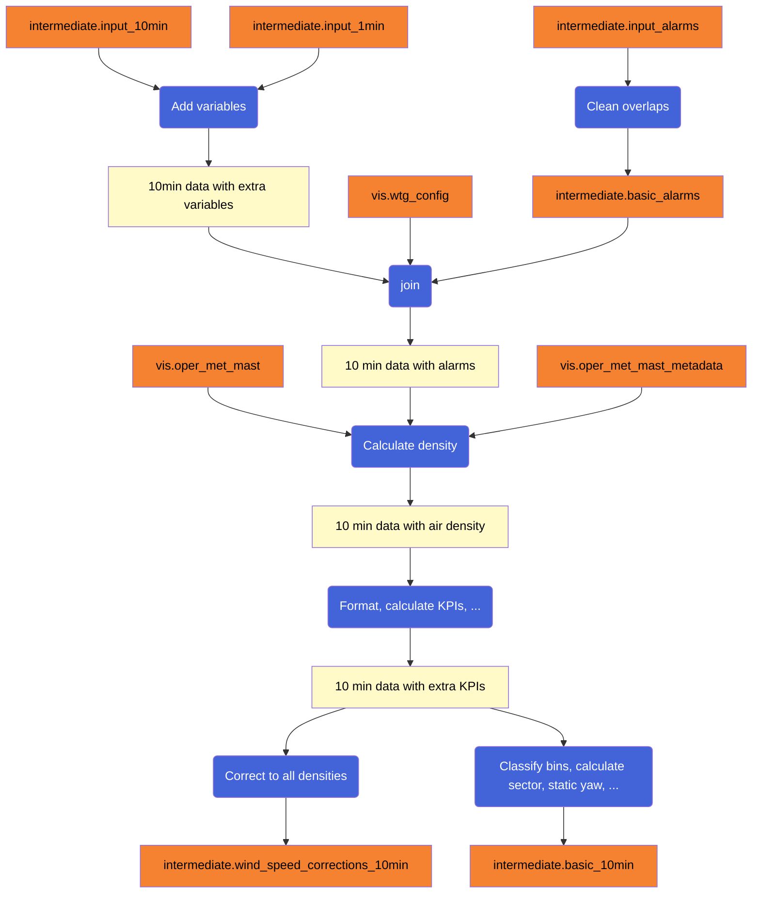
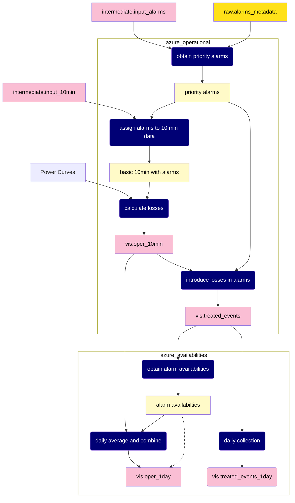

# Alarms treatment

We need to make several transformation at the level of 10-min data and individual events to fully explore availability.

This is the proposed schema.

[CONTINUAR AQUI]

The legend is:

- Yellow boxes represent static tables (they are not supposed to be updated)
- Pink boxes represent dynamic tables (they will be updated periodically)
- Beige boxes represent internal results (not intended to be written in a SQL table)

- Subgraph boxes represent Azure functions (set with a timer)
- Navy boxes represent different algorithms and processes that we need to develop

Thus, following the algorithms we need to develop (top to bottom) we have:

1. Obtain priority alarms. 

    - It takes the raw alarms and returns a treated logbook in which we don't have overlapping alarms. The cases of overlap are solved based on the severity scale and start datetime (in case of tie). __Issue #22: 27 May - 28 May__

    - Also, here we calculate the times between alarms. __Issue #28: 27 May - 30 May__

2. Assign alarms to 10-min data.

    - We need to take every 10-min data and assign its correspondant alarm (if any). In case of coexistence alarms in the same 10-min, we assign one based on the severity scale and duration. __Issue #23: 30 May - 31 May__

    - Also, we need to find non-registered events. __Issue #34 (Partially): 31 May - 5 June__  

3. Calculate losses.

    - We need to have some Power Curves to calculate the losses. Eventually, will have to calculate them, for the moment we'll upload the manufacturer curves, and use them instead. __Issue #26: 27 May - 31 June__

    - Migrate the algorithm for loss calculations. __Issue #24: June 3 - June 4__

4. Introduce the losses in the alarms

    - We need to add to the treated logbook the non-registered events we have found. __Issue #34 (Partially): 31 May - 5 June__

    - The losses we have obtain for each 10-min, need to be added up into their respective alarms. __Issue #25: 4 June - 5 June__

5. Calculate availabilities.

    - Operational Availability (and general framework). __Issue #27: May 28 - May 31__
    
    - Wind Availability. __Issue #29: May 30 - May 31__

    - Production Availability. __Issue #31: May 30 - May 31__   

    - Technical Availability. __Issue #30: May 30 - May 31__

    - Effective availability. __Issue #32: May 30 - May 31__ 

    - Manufacturer Availability (also including a yearly variable to accumulate maintenance time). __Issue #33: May 30 - June 5__
   

6. Daily average and combine.

    - Average the different 10-min data daily, and merge the info with the different availabilities. __Issue #16: June 4 - June 7__

7. Daily collection.

    - From the treated events table, generate also daily stats. __Issue #17: June 4 - June 7__

These different processes are planned to be implemented in two Azure function:

- azure_operational: Functions 1-4. The main output is vis.oper_10min and vis.treated_events. Ideally should run every 10 minutes.

- azure_availabilities: Function 5-8. The main output is vis.oper_1day and vis.treated_events_1day. It should run every day.

In order to parallelize work, we have implemented some temporary shortcuts represented with dash lines in the scheme:

- After calculating the priority alarms (first intermediate result of operational), we are "copying" it to vis.treated_alarms, filling missing values

- After calculating the operational availability, we are creating a temporary vis.oper_1day table. It has the final structure, but most values (like losses) are set to zero.

## Risks

- Should the join of realtime alarms and metadata be incremental or global? Global is less efficient, but easier to implement and less dangerous (as alarms have a duration, can be tricky to fix the time limits to consider). 
Initially, we'll develop these algorithms globally. Later on, we'll try to collect and append only new data.

- We could interact with WOD package. This could save time in the end, but it could has some problems at the beginning and slow down some development.

- We'll need to be careful with running time and optimization. Maybe this won't fit in 10 minutes (if we are not being incremental) and we need a longer period of refresh.

- Right now we have gaps of data. We'll need to think on how to fill them.

- We need to identify lapm and sector management