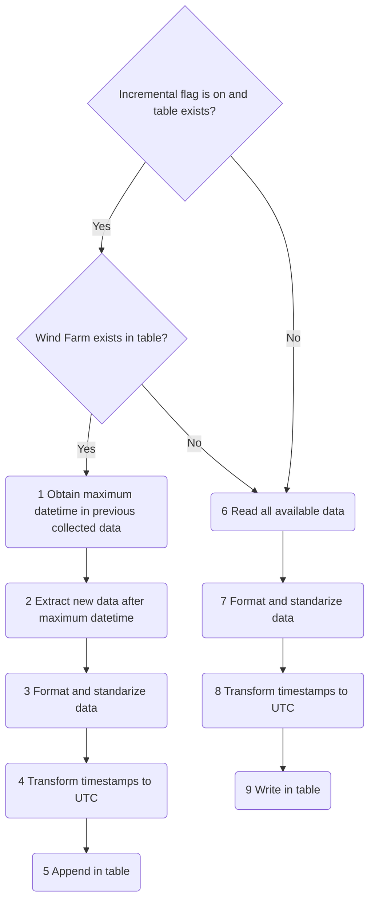
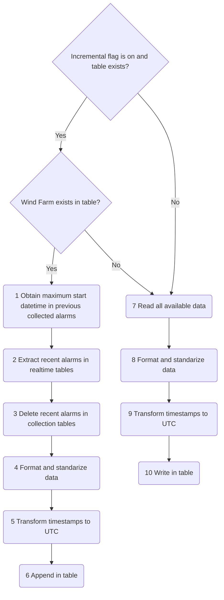

# Data Collection

For each wind farm added to the project we'll have different realtime data. For each wind farm we should have four tables (in the raw schema):

- realtime_input_10min_{Wind Farm Name}
- realtime_input_1min_{Wind Farm Name}
- realtime_alarms_{Wind Farm Name}
- realtime_pitch_{Wind Farm Name}

and also a table for each met mast, with the name realtime_met_mast_{Met Mast ID}

It's up to ACWA to maintain these tables updated, or to point to the real data sources.

For each one of these data sources, we'll build a standarized table with data from all the wind farms (or Met Mast). This process will standarized column names, and add the 'id_wf' column to mark the procedence of the data.

The output tables of this process are:

- intermediate.input_10min
- intermediate.input_1min
- intermediate.input_alarms
- intermediate.pitch
- vis.oper_met_mast

The scripts have an incremental flag that can be True or False. If True we only update new data, if False we overwrite the entire table.

The scripts run a loop on the different Wind Farms, and execute the following logic:

Updating alarms is a bit more complicated:

