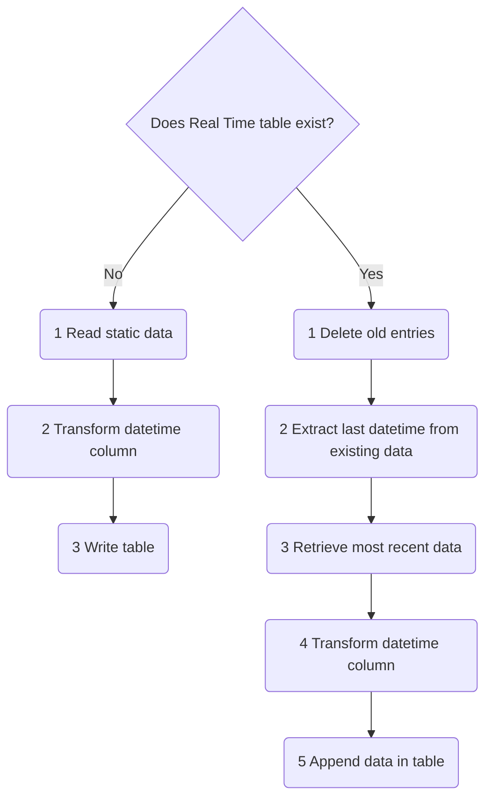

# Data Mockup

## Static Data Loading

## Dynamic Data Loading

```mermaid
graph TD

    Q1{Does Real Time table exist?} -- No --> A6(1 Read static data)
    A6 --> A7(2 Transform datetime column)
    A7 --> A8(3 Write table)

    Q1 -- Yes --> A1(1 Delete old entries)
    A1 --> A2(2 Extract last datetime from existing data)
    A2 --> A3(3 Retrieve most recent data)
    A3 --> A4(4 Transform datetime column)
    A4 --> A5(5 Append data in table)

    
    
```