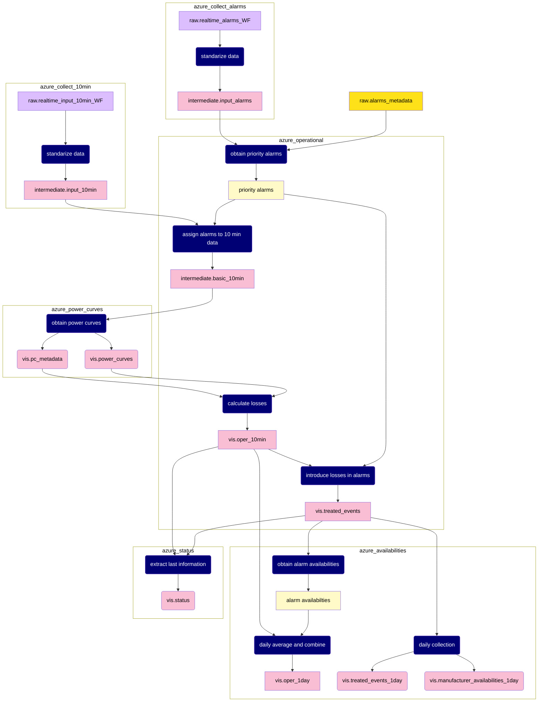

# Full Scheme

```mermaid

graph TD

    subgraph AZ3[azure_collect_10min]
    DynTableCol1[raw.realtime_input_10min_WF]:::DynTableCol --> Func10(standarize data):::Function
    Func10 --> DynTable1[intermediate.input_10min]:::DynTable
    end 

    subgraph AZ4[azure_collect_alarms]
    DynTableCol2[raw.realtime_alarms_WF]:::DynTableCol --> Func11(standarize data):::Function
    Func11 --> DynTable2[intermediate.input_alarms]:::DynTable
    end 

    DynTable2 --> Func1(obtain priority alarms):::Function
    StaticTable3[raw.alarms_metadata]:::StaticTable --> Func1
    DynTable1 -->Func2

    subgraph AZ6[azure_power_curves]
    
    Func13(obtain power curves):::Function --> DynTable14(vis.pc_metadata):::DynTable
    Func13 --> DynTable15(vis.power_curves):::DynTable
    end

    DynTable13 --> Func13

    subgraph AZ1[azure_operational]
    Func1 --> IntResult4[priority alarms]:::InternalResult
    IntResult4 --> Func2(assign alarms to 10 min data):::Function
    Func2 --> DynTable13[intermediate.basic_10min]:::DynTable
    
    DynTable14 --> Func4(calculate losses):::Function
    DynTable15 --> Func4
    Func4 --> DynTable6[vis.oper_10min]:::DynTable

    DynTable6 --> Func5(introduce losses in alarms):::Function
    IntResult4 --> Func5
    Func5 --> DynTable7[vis.treated_events]:::DynTable
    end

    
    
    subgraph AZ2[azure_availabilities]
    DynTable7 --> Func6(obtain alarm availabilities):::Function
    Func6 --> IntResult2[alarm availabilties]:::InternalResult
    DynTable6 --> Func8(daily average and combine):::Function
    IntResult2 --> Func8
    Func8 --> DynTable10[vis.oper_1day]:::DynTable
    DynTable7 ----> Func9(daily collection):::Function
    Func9 --> DynTable11(vis.treated_events_1day):::DynTable
    Func9 --> DynTable16(vis.manufacturer_availabilities_1day):::DynTable
    end

    subgraph AZ5[azure_status]
    DynTable6 --> Func12(extract last information):::Function
    DynTable7 --> Func12
    Func12 --> DynTable12(vis.status):::DynTable
    end

    classDef DynTable fill: #fabed4, color: #000
    classDef AzFunc fill: #4363d8, color: #FFF
    classDef StaticTable fill: #ffe119, color: #000
    classDef Function fill:#000075, color: #FFF
    classDef InternalResult fill:#fffac8, color: #000
    classDef DynTableCol fill: #dcbeff, color: #000


    style AZ1 fill:#FFF, color: #000
    style AZ2 fill:#FFF, color: #000
    style AZ3 fill:#FFF, color: #000
    style AZ4 fill:#FFF, color: #000
    style AZ5 fill:#FFF, color: #000
    style AZ6 fill:#FFF, color: #000
```