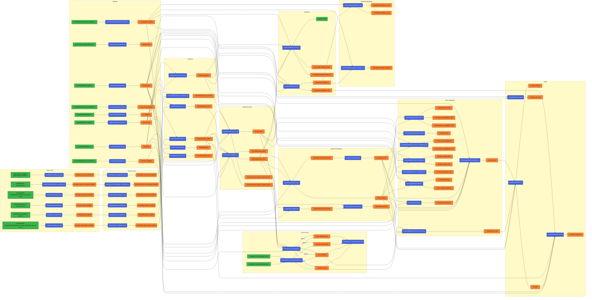

# Full Scheme

```mermaid

graph LR

    %% Static Load
    subgraph SG1[Static Load]

    File_10min[input/Historical data/WINDCR_DATAMIN_TALL2023_aggregated_data_10 min.csv]:::File --> Script_Static10min(scripts/static_load/min_10.py):::Script
    Script_Static10min --> Table_Static10min(raw.static_input_10min_windfarm):::Table

    File_1min[input/Historical data/WINDCR_DATAMIN_TALL2023_1 min.csv]:::File --> Script_Static1min(scripts/static_load/min_1.py):::Script
    Script_Static1min --> Table_Static1min(raw.static_input_1min_windfarm):::Table

    File_alarms[input/alarms/Alarm All turbines 2023.csv]:::File --> Script_StaticAlarms(scripts/static_load/alarms.py):::Script
    Script_StaticAlarms --> Table_StaticAlarms(raw.static_alarms_windfarm):::Table

    File_Pitch[input/Historical data/pitch angle.xlsx]:::File --> Script_StaticPitch(scripts/static_load/pitch.py):::Script
    Script_StaticPitch --> Table_StaticPitch(raw.static_pitch_windfarm):::Table

    File_MetMast[input/Historical data/MET MAST DATA OF 2023.xlsx]:::File --> Script_StaticMetMast(scripts/static_load/met_mast.py):::Script
    Script_StaticMetMast --> Table_StaticMetMast(raw.static_met_mast_metmastid):::Table

    File_Tower[input/Historical data/TowXY.xlsx]:::File --> Script_StaticTower(scripts/static_load/tower_acceleration.py):::Script
    Script_StaticTower --> Table_StaticTower(raw.static_tower_acceleration_windfarm):::Table
    
    end

    %% Dynamic Load
    subgraph SG2[Dynamic Load]

    Table_Static10min --> Script_Dynamic10min(scripts/dynamic_load/min_10.py):::Script --> Table_Dynamic10min(raw.realtime_input_10min_windfarm):::Table

    Table_Static1min --> Script_Dynamic1min(scripts/dynamic_load/min_1.py):::Script --> Table_Dynamic1min(raw.realtime_input_1min_windfarm):::Table

    Table_StaticAlarms --> Script_DynamicAlarms(scripts/dynamic_load/alarms.py):::Script --> Table_DynamicAlarms(raw.realtime_alarms_windfarm):::Table

    Table_StaticPitch --> Script_DynamicPitch(scripts/dynamic_load/pitch.py):::Script --> Table_DynamicPitch(raw.realtime_pitch_windfarm):::Table

    Table_StaticMetMast --> Script_DynamicMetMast(scripts/dynamic_load/met_mast.py):::Script --> Table_DynamicMetMast(raw.realtime_met_mast_metmastid):::Table

    Table_StaticTower --> Script_DynamicTower(scripts/dynamic_load/tower_acceleration.py):::Script --> Table_DynamicTower(raw.realtime_tower_acceleration_windfarm):::Table

    end


    %% Metadata
    subgraph SG3[Metadata]

    File_AlarmsMetadata[input/metadata/alarms_metadata.xlsx]:::File -->  Script_AlarmsMetadata(scripts/metadata/alarms.py):::Script
    Script_AlarmsMetadata --> Table_AlarmsMetadata[vis.alarms_metadata]:::Table

    File_WfConfig[input/metadata/wf_config.csv]:::File --> Script_WfConfig(scripts/metadata/wind_farms.py):::Script
    Script_WfConfig --> Table_WfConfig[vis.wf_config]:::Table

    File_WtgConfig[input/metadata/wtg_config.csv]:::File --> Script_WtgConfig(scripts/metadata/turbines.py):::Script
    Script_WtgConfig --> Table_WtgConfig[vis.wtg_config]:::Table

    File_MetMastMetadata[input/metadata/met_mast_metadata.csv]:::File --> Script_MetMastMetadata(scripts/metadata/met_mast.py):::Script
    Script_MetMastMetadata --> Table_MetMastMetadata[vis.met_mast_metadata]:::Table

    File_Densities[input/metadata/densities.csv]:::File --> Script_Densities(scripts/metadata/densities.py):::Script
    Script_Densities --> Table_Densities[vis.densities]:::Table

    File_Sectors[input/metadata/sectors.csv]:::File --> Script_Sectors(scripts/metadata/sectors.py):::Script
    Script_Sectors --> Table_Sectors[vis.sectors]:::Table    

    File_TempSignals[input/metadata/temperature_signals.csv]:::File --> Script_TempSignals(scripts/metadata/temperature_signals.csv):::Script
    Script_TempSignals --> Table_TempSignals[vis.temperature_signals]:::Table

    File_AEP[input/annual_energy_production.txt]:::File --> Script_AEP(scripts/monthly_production.py):::Script
    Script_AEP --> Table_AEP[vis.AEP_table]:::Table

    end

    %% Collection
    subgraph SG4[Collection]

    Table_Dynamic10min --> Script_Collect10min(scripts/collection/min_10.py):::Script
    Table_WfConfig --> Script_Collect10min
    Script_Collect10min --> Table_Collect10min[intermediate.input_10min]:::Table

    Table_Dynamic1min --> Script_Collect1min(scripts/collection/min_1.py):::Script
    Table_WfConfig --> Script_Collect1min
    Script_Collect1min --> Table_Collect1min[intermediate.input_1min]:::Table

    Table_DynamicAlarms --> Script_CollectAlarms(scripts/collection/alarms.py):::Script
    Table_WfConfig --> Script_CollectAlarms
    Script_CollectAlarms --> Table_CollectAlarms[intermediate.input_alarms]:::Table

    Table_DynamicPitch --> Script_CollectPitch(scripts/collection/pitch.py):::Script
    Table_WfConfig --> Script_CollectPitch
    Script_CollectPitch --> Table_CollectPitch[intermediate.pitch]:::Table

    Table_DynamicMetMast --> Script_CollectMetMast(scripts/collection/met_mast.py):::Script
    Table_WfConfig --> Script_CollectMetMast
    Script_CollectMetMast --> Table_OperMetMast[vis.oper_met_mast]:::Table

    Table_DynamicTower --> Script_CollectTower(scripts/collection/tower_acceleration.py):::Script
    Table_WfConfig --> Script_CollectTower
    Script_CollectTower --> Table_CollectTower[intermediate.tower_acceleration]:::Table

    end

    %% Operational
    subgraph SG5[Operational Basic]

    Table_Collect1min --> Script_Oper1Min(scripts/operational/min_1.py):::Script
    Table_WtgConfig --> Script_Oper1Min
    Table_CollectAlarms --> Script_Oper1Min
    Table_Sectors --> Script_Oper1Min
    Script_Oper1Min --> Table_Oper1Min[vis.oper_1min]:::Table
    Script_Oper1Min --> Table_WSCorrections1Min[intermediate.wind_speed_corrections_1min]:::Table

    Table_Collect10min --> Script_OperBasic(scripts/operational/basic.py):::Script
    Table_WtgConfig --> Script_OperBasic
    Table_CollectAlarms --> Script_OperBasic
    Table_Sectors --> Script_OperBasic
    Table_CollectPitch --> Script_OperBasic
    Script_OperBasic --> Table_Basic10min[intermediate.basic_10min]:::Table
    Script_OperBasic --> Table_BasicAlarms[intermediate.basic_alarms]:::Table
    Script_OperBasic --> Table_WSCorrections10Min[intermediate.wind_speed_corrections_10min]:::Table

    end

    %% Power Curves

    subgraph SG6[Power Curves]

    %% This first script could be considered metadata as well...
    File_PcMetadata[input/power_curves/pc_metadata.csv]:::File --> Script_ManufacturerPowerCurves(scripts/power_curves/manufacturer.py):::Script
    File_ManufacturerPc[input/power_curves/original_pc.csv]:::File --> Script_ManufacturerPowerCurves
    Script_ManufacturerPowerCurves --> Table_PcMetadata[vis.pc_metadata]:::Table
    Script_ManufacturerPowerCurves --> Table_PowerCurves[vis.power_curves]:::Table
    Script_ManufacturerPowerCurves --> Table_PcMetadata1min[vis.pc_metadata_1min]:::Table
    Script_ManufacturerPowerCurves --> Table_PowerCurves1min[vis.power_curves_1min]:::Table

    Table_Sectors --> Script_PowerCurves(scripts/power_curves/data.py):::Script
    Table_Basic10min --> Script_PowerCurves
    Table_PcMetadata --> Script_PowerCurves
    Table_WSCorrections10Min --> Script_PowerCurves
    Table_Oper1Min --> Script_PowerCurves
    Table_WSCorrections1Min --> Script_PowerCurves
    Script_PowerCurves -- append --> Table_PowerCurves
    Script_PowerCurves -- append --> Table_PcMetadata
    Script_PowerCurves -- append --> Table_PowerCurves1min
    Script_PowerCurves -- append --> Table_PcMetadata1min

    Table_PowerCurves --> Script_PcInterpol(scripts/power_curves/interpolation.py):::Script
    Table_PcMetadata --> Script_PcInterpol
    Table_PowerCurves1min --> Script_PcInterpol
    Table_PcMetadata1min --> Script_PcInterpol

    end

    %% Reliability

    subgraph SG7[Reliability]

    Table_WtgConfig --> Script_RelFit(scripts/reliability/fit_models.py):::Script
    Table_Basic10min --> Script_RelFit
    Table_OperMetMast --> Script_RelFit
    Table_TempSignals --> Script_RelFit
    Script_RelFit --> File_Models(output/qr_models):::File
    Script_RelFit --> Table_RelModels[intermediate.reliability_models]:::Table
    Script_RelFit --> Table_RelModelsInfo[intermediate.reliability_models_info]:::Table

    Table_WtgConfig --> Script_RelPredict(scripts/reliability/predict.py):::Script
    Table_Basic10min --> Script_RelPredict
    Table_OperMetMast --> Script_RelPredict
    Table_TempSignals --> Script_RelPredict
    Script_RelPredict --> Table_Reliability[intermediate.reliability_ts]:::Table
    Script_RelPredict --> Table_ReliabilityLast[intermediate.reliability_ts_last]:::Table

    end

    %% Operational Advanced

    subgraph SG8[Operational Advanced]

    Table_Sectors --> Script_OperLosses(scripts/operational/losses.py):::Script
    Table_Basic10min --> Script_OperLosses
    Table_BasicAlarms --> Script_OperLosses
    Script_OperLosses --> Table_AlarmsWithLosses[intermediate.alarms_with_losses]:::Table
    Script_OperLosses --> Table_Oper10min[vis.oper_10min]:::Table

    Table_AlarmsWithLosses --> Script_AlarmsStats(scripts/operational/stats.py):::Script
    Script_AlarmsStats --> Table_TreatedEvents[vis.treated_events]:::Table

    Table_CollectPitch --> Script_OperPitch(scripts/operational/pitch.py):::Script
    Table_Basic10min --> Script_OperPitch
    Script_OperPitch --> Table_PitchWithLambda[intermediate.pitch_with_lambda]:::Table

    Table_PitchWithLambda --> Script_Reference(scripts/operational/reference.py):::Script
    Table_WfConfig --> Script_Reference
    Script_Reference --> Table_Reference[intermediate.reference]:::Table

    end

    %% Reliability Aggregates

    subgraph SG9[Reliability Aggregates]

    Table_Reliability --> Script_AggRelTS(scripts/reliability/aggregate_ts.py):::Script
    Table_TempSignals --> Script_AggRelTS
    Script_AggRelTS --> Table_ReliabilityHour[intermediate.reliability_ts_hour]:::Table
    Script_AggRelTS --> Table_ReliabilityDay[intermediate.reliability_ts_day]:::Table

    Table_Reliability --> Script_AggRelHeatmaps(scripts/reliability/aggregate_heatmaps.py):::Script
    Table_TempSignals --> Script_AggRelHeatmaps
    Script_AggRelHeatmaps --> Table_ReliabilityHeatmaps[intermediate.reliability_heatmaps]:::Table

    end

    %% Other aggregates
    subgraph SG10[Other aggregates]

    Table_WtgConfig --> Script_Maintenance(scripts/maintenance.py):::Script
    Table_TreatedEvents --> Script_Maintenance
    Script_Maintenance --> Table_Maintenance[intermediate.maintenance]:::Table
    
    Table_WtgConfig --> Script_Availability(scripts/aggregation/availabilities.py):::Script
    Table_Oper10min --> Script_Availability
    Table_TreatedEvents --> Script_Availability
    Table_Maintenance --> Script_Availability
    Table_AlarmsMetadata --> Script_Availability
    Table_AEP --> Script_Availability
    Script_Availability --> Table_Oper1Day[vis.oper_1day]:::Table

    Table_Oper10min --> Script_Allocation(scripts/aggregation/allocation.py):::Script
    Table_TreatedEvents --> Script_Allocation
    Script_Allocation --> Table_TreatedEvents1day[vis.treated_events_1day]:::Table
    Script_Allocation --> Table_Component1day[vis.component_availabilities_1day]:::Table
    Script_Allocation --> Table_Manufacturer1day[vis.manufacturer_availabilities_1day]:::Table

    Table_Oper1Min --> Script_DynamicYaw(scripts/aggregation/dynamic_yaw.py):::Script
    Script_DynamicYaw --> Table_DynamicYaw[vis.dynamic_yaw]:::Table

    Table_Oper10min --> Script_MaxPowerMisallignment(scripts/aggregation/max_power_misallignment.py):::Script
    Table_Oper1Min --> Script_MaxPowerMisallignment
    Script_MaxPowerMisallignment --> Table_MaxPowerMisallignment[vis.max_power_misallignment]:::Table
    Script_MaxPowerMisallignment --> Table_MaxPowerMisallignment1min[vis.max_power_misallignment_1mi]:::Table

    Table_Oper10min --> Script_PerfRatio(scripts/aggregation/performance_ratio.py):::Script
    Table_PowerCurves --> Script_PerfRatio
    Table_PcMetadata --> Script_PerfRatio
    Script_PerfRatio --> Table_PerfRatio[vis.performance_ratio]:::Table

    Table_Oper10min --> Script_LaPM(scripts/aggregation/lapm_analysis.py):::Script
    Table_Oper1Min --> Script_LaPM
    Table_Sectors --> Script_LaPM
    Script_LaPM --> Table_LaPM10min[vis.lapm_analysis_10min]:::Table
    Script_LaPM --> Table_LaPM1Min[vis.lapm_analysis_1min]:::Table

    Table_CollectTower --> Script_AggTowerAcc(scripts/aggregation/tower_acceleration.py):::Script
    Script_AggTowerAcc --> Table_TowerAcc1day[vis.tower_acceleration_1day]:::Table
    
    Table_Oper10min --> Script_Weibull(scripts/aggregation/weibull.py):::Script
    Table_OperMetMast --> Script_Weibull
    Table_WtgConfig --> Script_Weibull
    Script_Weibull --> Table_WeibullDist[vis.weibull_distribution]:::Table
    Script_Weibull --> Table_ShortWeibullDist[vis.short_weibull_distribution]:::Table

    end

    %% Status
    subgraph SG11[Status]

    Table_Oper10min --> Script_StatusTurbine(scripts/status/turbine.py):::Script
    Script_StatusTurbine --> Table_OperLastDay[vis.oper_last_day]:::Table
    Table_TreatedEvents --> Script_StatusTurbine
    Table_PerfRatio --> Script_StatusTurbine
    Table_Oper1Day --> Script_StatusTurbine
    Script_StatusTurbine --> Table_Status[vis.status]:::Table

    Table_WtgConfig --> Script_StatusMetMast(scripts/status/met_mast.py):::Script
    Table_OperMetMast --> Script_StatusMetMast
    Script_StatusMetMast --> Table_StatusMetMast[vis.status_met_mast]:::Table
    
    Table_AlarmsMetadata --> Script_StatusComp(scripts/status/component.py):::Script
    Table_TempSignals --> Script_StatusComp
    Table_Status --> Script_StatusComp
    Table_CollectAlarms --> Script_StatusComp
    Table_ReliabilityLast --> Script_StatusComp
    Script_StatusComp --> Table_StatusComp[vis.status_component]:::Table


    end


    classDef File fill: #3cb44b, color: #000
    classDef Table fill: #f58231, color: #000
    classDef Script fill: #4363d8, color: #FFF

    style SG1 fill:#fffac8, color: #000
    style SG2 fill:#fffac8, color: #000
    style SG3 fill:#fffac8, color: #000
    style SG4 fill:#fffac8, color: #000
    style SG5 fill:#fffac8, color: #000
    style SG6 fill:#fffac8, color: #000
    style SG7 fill:#fffac8, color: #000
    style SG8 fill:#fffac8, color: #000
    style SG9 fill:#fffac8, color: #000
    style SG10 fill:#fffac8, color: #000
    style SG11 fill:#fffac8, color: #000

    linkStyle default stroke: black

```