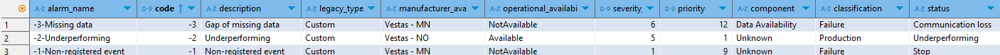

# Metadata Upload

As the first stage of the process, we will need to upload different metadata tables. These tables will inform us about the available Wind Farms (WF), their turbines (WTG), how they organize in groups, which LaPM or WSM sectors apply to each one, etc. Future tables and results will be organized around this information.

The different information we need to collect in these tables have been provided from different sources (documents, e-mails, etc.). We will proceed in a similar way in each case:

1. Organize the received information in a csv or Excel file.
2. Develop a script to read that csv and build the correspondent tables.

When a new WF is added to the system, we will need to make sure that it is properly informed in each one of these tables.

## Alarms metadata

The original information has been treated in an Excel file, saved in the path input/metadata/alarms_metadata.xlsx (container: data)

The script at acwa.scripts.metadata.alarms reads the file and uploads the info at the table vis.alarms_metadata. It also adds the metadata about the custom events that we defined for the data outside the canonical logged events:

- Non-registered events (Code: -1): We apply this alarm when we have data points with no power, good wind conditions and no other alarm.
- Underperforming (Code: -2): We apply this alarm for moments where the turbine is running, there is no other alarm, but production is lower than expected.
- Missing data (Code: -3): We will apply this alarm for missing timestamps (i.e. the row of data is missing for one or several 10-min segments)

In this script we only define the metadata information for these custom alarms, in following scripts we will detail how we assign these alarms.

The final table has the following fields:

| Column Name               | Type    | Description                         | Boundaries | Comments |
| ------------------------- | ------- | ----------------------------------- | ---------- | -------- |
| alarm_name                | varchar | Name of the alarm                   |            |          |
| code                      | bigint  | Unique code to id each alarm        |            |          |
| legacy_type               | varchar |                                     |            | Not used |
| manufacturer_availability | varchar | Manufacturer concept of the alarm   |            |          |
| operational_availability  | varchar | Availability Status                 |            | Not used |
| severity_scale            | bigint  | Severity of the alarm               |            |          |
| priority                  | bigint  | Assigned priority according to norm |            |          |
| component                 | varchar | Affected component                  |            |          |
| classification            | varchar | Classification of the alarm         |            | Not used |
| status                    | varchar | General status (Running, Stop, ...) |            |          |

These are the custom alarms that we add to the system:

### Pending work

#### Adapt to multi-farm structure

We are considering the original alarms information from the Vestas turbines that apply to the Khalladi farm. We should modify this for the scenario of a new wind farm with different alarms (Issue #39)

#### Clean unused fields

Some of the fields that appear in this table: legacy_type, operational_availability and classification are not used in the current state of the code. We should clean them. (Issue #196)

## Wind Farms

We need a table to define each WF that we introduce in the system. We write the information manually in a CSV file at input/metadata/wf_cnofig.csv. Then, with the script at acwa.scripts.metadata.wind_farms we upload the information to the table vis.wf_config. In this table, each row corresponds to a WF, with the following information:

| Column Name          | Type   | Description                            | Boundaries | Comments         |
| -------------------- | ------ | -------------------------------------- | ---------- | ---------------- |
| id_country           | bigint | Id of country                          |            |                  |
| id_wf                | bigint | Id of the wind farm                    |            |                  |
| wf_name              | varchar| Name of the WF                         |            |                  |
| latitude             | float  | Latitude WGS84                         | > -90, < 90|                  |
| longitude            | float  | Longitude  WGS84                       | >-180, <180|                  |
| number_of_wtg        | bigint | Number of turbines                     | > 0        |                  |
| installed_power      | float  | Installed Power in MW                  | > 0        |                  |
| contractual          | float  | Contractual Availability Threshold (%) | >=0, <=100 |                  |
| betz_limit           | float  | Betz Limit                             |            | Used by Power BI |
| tz_data              | varchar| Timezone for 10min and minute data     |            |                  |
| tz_alarms            | varchar| Timezone for alarms and auxiliar data  |            |                  |

This table defines the WFs that will be analyzed by the rest of the scripts.

If we add a new WF, it should be included here.

## Groups

Each Wind Farm will have different groups of turbines, that we will need to configure in its own table. Some information is specific for the group, such as the contractual date, limit of maintenance hours and Met Mast.

We prepare the information in a CSV file at input/metadata/groups.csv, and is uploaded with the script acwa.scripts.metadata.groups as the table vis.groups. It has the following columns:

| Column Name          | Type   | Description                         | Boundaries | Comments |
| -------------------- | ------ | ----------------------------------- | ---------- | -------- |
| id_wf                | bigint | Id of the wind farm                 |            |          |
| group                | bigint | Number of the group inside the WF   |            |          |
| id_group_complete    | varchar| Unique group idenitifier            |            |          |
| contractual_date     | date   | Date of the start of the contract   |            |          |
| maintenance_hours    | bigint | Number of allowed maintenance hours |            |          |
| met_mast             | varchar| Met Mast associated with the group  |            |          |

This is the current groups table. Khalladi has two groups, while the second dummy WF has one.

When a new WF is added, its groups should be defined here

## Turbines

We also need to define each Wind Turbine in a metadata table. We prepare the related information in a CSV file: input/metadata/wtg_config.csv. Then, we run the script at acwa.scripts.metadata.turbines to upload the table vis. It has the following columns:

| Column Name          | Type   | Description                         | Boundaries | Comments |
| -------------------- | ------ | ----------------------------------- | ---------- | -------- |
| id_wf                | bigint | ID of the wind farm                 |            |          |
| wf_name              | varchar| Name of the wind farm               |            |          |
| id_wtg               | bigint | ID of the WTG                       |            | Unique inside the WF |
| id_wtg_complete      | bigint | Unique ID of the WTG                |            | Unique across all WFs|
| wtg_name             | varchar| Name of the WTG                     |            |          |
| latitude             | float  | Latitude WGS84                      | > -90, < 90|                  |
| longitude            | float  | Longitude  WGS84                    | >-180, <180|                  |
| elevation            | bigint | Elevation (m)                       |            |          |
| nominal_power        | bigint | Nominal Power (kW)                  | > 0        |          |
| rotor_diameter       | bigint | Rotor Diameter (m)                  | > 0        |          |
| model                | varchar| Model of the WTG                    |            |          |
| manufacturer         | varchar| Name of manufacturer                |            |          |
| wind_speed_start     | float  | Lowest wind speed (m/s) at which power >0  | >0  |          |
| wind_speed_stop      | float  | Cut-off wind speed (m/s)            |            |          |
| reference_pc         | varchar| Reference Power Curve               |            |          |
| group                | bigint | Number of the group inside the WF   |            |          |
| id_group_complete    | varchar| Unique group idenitifier            |            |          |

When a new WF is added, its turbines should be defined here.

## Densities

The Khalladi Wind Farm has the special requirement of correcting the wind speed to different densities for some specific visual representations. For other WFs, this special treatment might not be needed.

We have prepared a very simple metadata table to configure this scenario. First we prepare manually the CSV file in the path input/metadata/densities.csv. The script at acwa.scripts.metadata.densities reads the file and uploads it as the table vis.densities. It has the following columns:

| Column Name          | Type   | Description                         | Boundaries | Comments |
| -------------------- | ------ | ----------------------------------- | ---------- | -------- |
| id_wf                | bigint | Id of the wind farm                 |            |          |
| density              | float  | Value of density to consider        |     > 0    |          |

This is the current aspect of this table:

For the first WF (Khalladi) we consider 4 different values of density, and we will be able to change between them at specific visuals. For the second WF, which is a dummy WF, we only have one density for wind speed correction.

If we add a new WF, it should be included here.

## Variables

At a specific Power BI visual [FUTURE REFERENCE HERE], we have a selector of the variable to plot. To build that selector, we need an external table with the variables names.

We have built the table vis.variables, with the script acwa.scripts.metadata.variables, that has the following columns:

| Column Name          | Type   | Description                         | Boundaries | Comments |
| -------------------- | ------ | ----------------------------------- | ---------- | -------- |
| schema               | varchar| Name of schema                      |            |          |
| table                | varchar| Name of table                       |            |          |
| variable             | varchar| Name of column                      |            |          |

For the moment, we are only showing here names of variables we want to plot from the table vis.oper_10min. If needed, we could extend this table for other tables.

Currently, the names of the chosen variables are directly introduced in the Python code. If needed, we could export the names into an external configuration file to ease the manipulation. For the moment, this has not been considered essential.

## Sectors

A turbine might have different wind direction sectors with different operations modes (LaPM, WSM, ...). We organize this information in the file input/metadata/sectors.csv, and run the script acwa.scripts.metadata.sectors to build the table vis.sectors with the following columns:

| Column Name          | Type   | Description                         | Boundaries | Comments |
| -------------------- | ------ | ----------------------------------- | ---------- | -------- |
| id_wtg_complete      | varchar| Unique ID of the WTG                |            |          |
| sector_name          | varchar| Operation Power Curve for the sector|            |          |
| sector_ini           | bigint | Start of the sector (º)             |  >=0, <=360|          |
| sector_fin           | bigint | End of the sector (º)               |  >=0, <=360|          |
| main                 | bit    | 1 if the sector is the predominant  |            |          |
