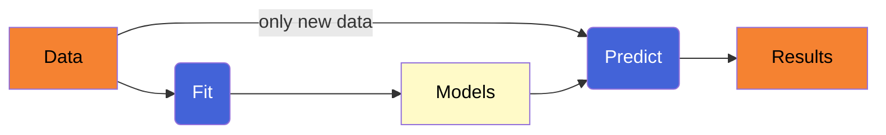

# Reliability

## Normalized Temperature

$$T_{\text{norm}} = \frac{T - \text{Lower Bound}}{\text{Upper Bound} - \text{Lower Bound}}$$

thus,

- $T_{\text{norm}} < 0$ if $T < \text{Lower Bound}$
- $T_{\text{norm}} = 0$ if $T = \text{Lower Bound}$
- 0 < $T_{\text{norm}} < 1$ if $\text{Lower Bound} < T < \text{Upper Bound}$
- $T_{\text{norm}} = 1$ if $T = \text{Upper Bound}$
- $T_{\text{norm}} > 1$ if $T > \text{Upper Bound}$ (over-temperature)
