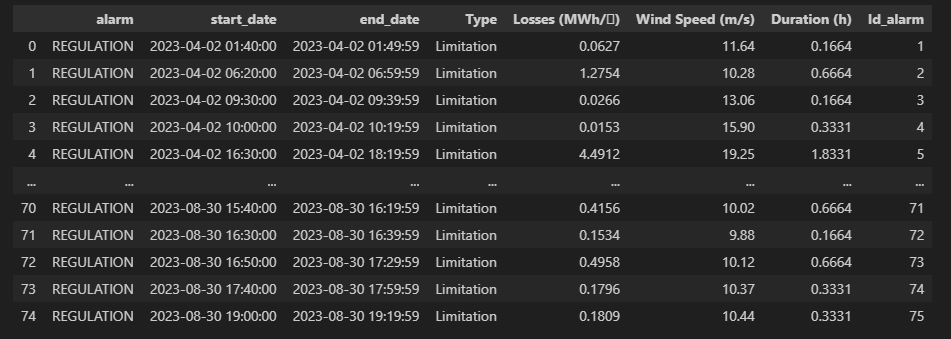
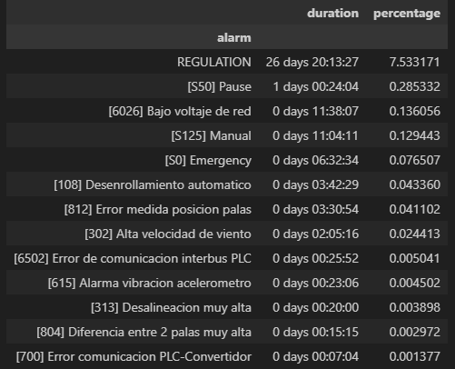
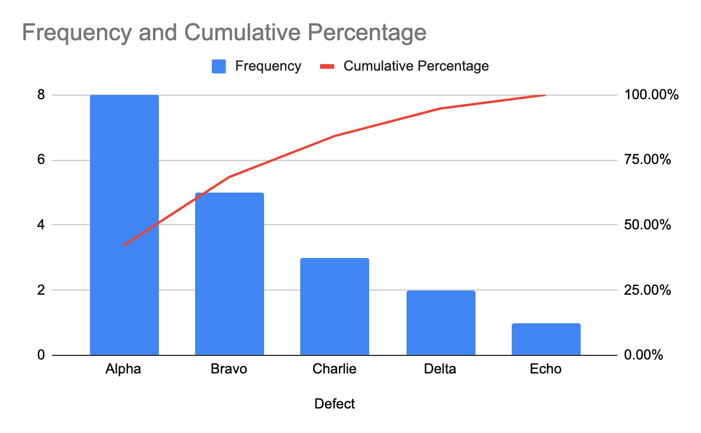

# Technical Specifications

## General Idea

We will have several Python processes to create the data tables that will be read from the PowerBI to obtain the visualizations.

Some of these tables we'll need to be refreshed in (almost) real-time. In the practice it means that we'll have to run some scripts periodically (daily, every 10 minutes, ...)

Ideally we should have some cloud services to support that. In the case of Azure:

- SQL Server and Database (this is mandatory)
- Functions
- Container Registry (only if code is too heavy for Azure functions)
- Kubernetes Services (only if code is too heavy for Azure functions) (this is not free)
- Storage Account
- Key Vault
- Managed Identity
- Azure DevOps (free tier is limited to 5 users, should be enough)

At the beginning we'll have static data (a file) to work with. We could mockup real-time data ingestion using those data, if we have access to this services.

Another option is to use a remote server (cloud or on premise). At the beginning we could use japeto.

## 1.1 Alarm Notebook

### Requirement

System shall be able to provide complete alarm historical logbook at least up to one year. It shall include occurrence of the event, duration and type of event (alarm or warning).

### Solution

Using the Alarms class in the WOD package we can gather this information and write an output table:

We'll probably need to:

- Adapt loading methods to the provided files
- Adapt the output format for PowerBI requirements

In this case, as it is just an historical log, we should not clean the alarms or processed them. Thus, we could read directly the raw input from PowerBI (maybe small formatting of columns could be required)

## 1.2 Pareto analysis

### Requirement

Pareto analysis of alarms by code and SCADA description to be included

### Solution

The Alarms class on the WOD package already gets some stats that could lead to a Pareto chart

Maybe we should add more info (losses, ...).

Maybe the PowerBI should show a Paretto chart:

## 1.3 Breakdown of unavailability

### Requirement

Breakdown of unavailability of each turbine with downtime alarms and respective percentage of unavailability.   

### Solution

The percentage of unavailability for turbine is just the sum of the stats taken with the Alarms class.

We just need to arrange this in a table at the wind farm level, with columns turbine and % of availability. But we need to be careful with the temporal range. Maybe we should do this at the day resolution, and PowerBI should make the averages.

## 1.4 All OPC signals/ parameters shall be visible real time

### Requirements

All OPC signals/ parameters shall be visible real time (as per the data resolution defined in the OPC server). All these OPC provided historical data is integrated in the monitoring system, and actively used for all applicable analytic features.

### Solution

Show the last state of the turbine ?
Maybe we'll need to develop a Python script to obtain the current state of the Wind Farm in general. This script should run periodically, for which we'll need a cloud service (Azure function, Kubernetes, ...)

## 1.5 Integration of Met masts

### Requirements

Integration of Met masts

### Solution

Prepare a table with clean information, average the data with PowerBI based on selectors.

We don't have anything in WOD to deal with met masts, maybe we should include them as a new class

## 2.1 Google Earth

### Requirements

Google earth world view or similar with locations of all WFs identified with total rela time productions of each WF

### Solution

Google Maps integration with PowerBI. Maybe we need to prepare a table with the layout.

## 2.2 Layout

### Requirements

Layout of each WF with locations of WTGs identified by an avatar that is rotating or not as per status of WTG - Operational or stopped. If the status is operational but stopped due to environmental reasons the avatar shall appear stopped and green. When stopped with a fault, it shall be stopped and red.

In the layout of each WF, a colour code must immediately identify availability problem, efficiency problem and overtemperature problem in respective WTG

### Solution

The layout table should be a "real-time" table, indicating the status.

## 2.3 Hover Real Time Data

### Requirements

By hoovering the mouse over each WTG, a corner window shows following real time data:

- Current WTG Status
- Current fault or warning event if any
- Current wind speed and wind direction
- Current production on WTG

### Solution

All these should be part of the "real-time" layout table. Using the tooltip option in PowerBI it should be possible (maybe?)

## 2.4 Clicking data

### Requirements

By clicking in each WTG, a sub menu shows up with:

- Power curve of last 60 rolling days against reference power curve
- Loss production factor or Energy availability
- Time based availability as per contract formula
- Timeseries of last 60 rolling days with produced Vs max potential production (producible)
- Temperature timeseries with warning and alarm limits for each SCADA temperature of selected component

### Solution

Maybe this is not possible by clicking on the layout

We should have daily processes to gather this information.

## 2.6 Availability dashboard KPIs

### Requirements

Show:

- Availability heatmap
- Production, potential production and lost production for each turbine and for each of main alarms causing downtime (turbine faults)
- Summary view with amount of turbines in full performance, downtime, Curtailment (LaPM is also considered curtailment), Communication loss, degraded and standby
- Manufacturer and operational availability for each turbine and for complete Plant
- Energy availability for each turbine and for complete Plant
- Real time Active alarms and respective losses
- Top 20 alarms Pareto analysis on frequency and downtime, for the complete WF and for each turbine
- Times allocation for each time category on the availability calculation (Utility, Owner, Environmental, Manufacturer, etc)
- MTTR and MTBF for any selected period
- Consider the special maintenance treatment (it is expected 80 hours of maintenance; if there are more hours in maintenance, the difference should be considered as an unavailable turbine)
- Calculate wind availability
- Calculate technical availability *(considering the justified and not justified stops)
- Calculate production availability
- Calculate effective availability
- Calculate the differences between the contractual availability and the different values of availability (per turbine) 
- Graphics to show the accumulated availability per turbine (from the start day). The variability of this value. And comparison with the contract availability and the average

### Solution

In principle, we could have different data tables to show this info, based on PowerBI needs.

In case of real time, we should establish the periodicity (or refresh rate)

## 2.7 Efficiency dashboard

### Requirements

- Budget production (P50, P75 and P90) and actual cumulative production YTD, MTD, Previous month (at energy meters of WF and at each turbine counter)
- Graph timeseries with Active power, Expected/ potential power and Wind speed (Nacelle) for each turbine and for complete Wind farm.
-  Power curve plot historical last 6 months and current month in the same graph, including also the theoretical reference PC applicable (all wind speeds normalized according to IEC standard)
- Average Wind speed of each turbine and of met mast
- Equivalent/ full load hours for each turbine
- Met mast real time data including wind speed, wind direction and air density
- Heat Mapping of monthly Yaw angle averages relative to median of respective Turbines’ group
- Heat mapping monthly Cps relative to median of respective Turbines’ group
- Capacity factor for each turbine and for the complete WF
- Performance indicator heatmap
- Plot of SCADA Power curve vs reference MTD and YTD 
- Efficiency ratio of the WF
- Efficiency ratio of each turbine heatmap. 
- Summary of efficiency related notifications with direct link to the explaining graph, where the deviation was first identified by the system.
- For each day selected, the system shall be able to provide a snapshot of the total possible generation, the losses due to unavailability, the losses/ gains due to power performance and the resulting actual generation. The data shall be presented in the shape of a waterfall graph and table. 
- Ratio to represent the wind average in comparison with the LT period
- Distribution parameters, and comparison with the expected  or LT
- Heatmaps of nacelle average wind speed

### Solution

Similar to previous case. 

We already have code to calculate Power Curves

We could have some problems with time period selection, maybe we can't have a time scroll filter in some cases (without running Python scripts)

## 2.8 Reliability dashboard KPIs

### Requirements

-  Timeseries graphs with development of normalized temperatures (and also vibrations when applicable) comparing to normal operating range. Separate graphs for Gearbox, Generator, transformer, converter and nacelle temperature.
- These timeseries shall plot estimated values, normal operating band, and residual value (delta between actual value and estimated value). 
- The residual value plot shall include respective alarm limits, consistent with the normal operating band system defines. 
- Reliability heatmap. 
- Control the signals of pressure
- Heatmaps of accumulative  frequency  of failures (possible other variables)

### Solution

Similar to previous case.

## 2.9 Executive summary

### Requirements

- Losses waterfall with links in each loss providing details of respective loss down to turbine component level
- Efficiency graph with measured efficiencies of each turbine
- Efficiency ratio as measured for the whole WF
- Summary table of deviations and respective notifications and automatically generated reports
- Real time status of each turbine
- Generic design of the turbine showing all major components and with color codes for reliability, efficiency and availability notifications. Each icon number is a link to further detail.
- Dashboard with the summary information of all the float per technology. Main results, and principal characteristics.
- Accumulative result per project and technology of parameters such as production and efficiency.
- If it is available, include in the analysis the price of the energy and the earnings of the project in financial terms.

### Solution

Energy price is provided or shall we obtain it externally?

## 1-min performance analytics

### Requirements

Includes:

- 3.1. Yaw static misalignment (including option to use OPC real time data)
- 3.2. Yaw dynamic performance (including option to use OPC real time data)
- 3.3. Rotor aerodynamic imballance (including option to use OPC real time data)
- 3.4. Rotor mass imbalance (including option to use OPC real time data)

### Solution

1-min data would be the more demanding storage-wise

## Cp graphs

### Requirements

- Cp analysis with option to compare multiple WTGs in the same graph and multiple time periods for same WTG in the same graph
- Cp timeseries for multiple WTGs
- Cp heatmap (last 30 rolling days)
- Performance ratio

### Solution

Need to know exactly how to calculate the Cp

## Wind Distribution

### Requirements

Wind Distribution (Weibull distribution)

### Solution 

Probably we'll need to pre-calculate the distribution for some set of fixed periods (days, months, last X days)

## Power Curves

### Requirements

- 3.7 power curve plotting
- 3.8 Power curve plot for complete WF
- 3.9. Power curve (PC) plot against reference power curve for each turbine, with following options:
    - Option to select specific air density or default option for the automatically calculated value, and respective reference power curve correction in the analysis 
    - Capability to normalize wind speeds according to IEC standards, according to air densities
    - Option to filter or not outliers, fault periods, or randomly scattered bins
    - Option to plot bin points Vs reference PC for selected wind directions (as many as needed)
    - Possibility to plot real power curves against the reference power curve multi turbines in the same graph 
    - Possibilty to plot PCs of same turbine for different time slots in the same graph
    - Power curve plot against average power curve of last 3 months, 6 months or 12 months (to be selected)

### Solution

We have a module to calculate Power Curves in WOD. Probably, we´ll need to modify it heavily to allow different data filtering.

## Scatter Plots

### Requirements

- 3.10. Plot of power against rotor speed and generator speed, with option for multi turbines and multi time periods
- 3.11. Plot of rotor speed and generator speed against wind speed, with option for multi turbines and multi time periods
- 3.12. Plot of power against pitch angle, with option for multi turbines and multi time periods
- 3.13. Plot of pitch angle against wind speed, with option for multi turbines and multi time periods
- 3.14. Plot of pattern of productions for each turbine, with option for multi turbines and multi time periods

### Solution

Probably we don't need a lot of data processing here, just create tables with columns x, y and legend.

## Report

### Requirements

They want to export to PDF

### Solution

PowerBI allows to export to PDF (in principle...)

## Losses Waterfalls

### Requirements

- 5.1 Energy losses waterfall for each SCADA time category
- 5.2 Energy losses waterfall for each fault event downtime (totsl for each fault code) 
- 5.3 Energy losses waterfall for each WTG component

### Solution

We have a module to calculate losses in WOD. We'll need to format the output data properly.

## Availability loss

### Requirements

- for each fault event
- for each WTG component

### Solution

What's the difference with the previous case?

## Advanced diagnostics

### Requirements

- 7.1. Pitch Position Mismatch:  Pitch angle blade A, B and C. If not made available by OPC for each blade, to be checked alternatives how this failure mode can be defined.
- 7.2. Gen Voltage error: PHASE_VOLTAGE_GENERATOR
- 7.3. Generator Current error: PHASE_CURRENT_GENERATOR
- 7.4. Nacelle Overtemperature: NACELLE_TEMPERATURE
- 7.5. Hydraulic System failure: HYDRAULIC OIL TEMPERATURE AND PRESSURE
- 7.6. Generator Cooling failure: GENERATOR WATERTEMPERATURE
- 7.7. Gearbox Early alarm: TEMPERATURES AND VIBRATIONS, INCLUDING CALCULATED KURTOSIS, PROVIDED CREST FACTORS AND ACCELERATION SIGNALS.
- 7.8. Generator Bearing Early alarm: TEMPERATURES AND VIBRATIONS, INCLUDING CALCULATED KURTOSIS, PROVIDED CREST FACTORS AND ACCELERATION SIGNALS.
- 7.9. Potential Anemometer issue: WIND_SPEED
- 7.10. Main-Shaft/ Main Bearing early alarm: MAIN BEARING VIBRATIONS AND TEMPERATURES.
- 7.11. Generator Winding early alarm: WINDING TEMPERATURES, CURRENTS AND VOLTAGES
- 7.12. Overtemperatures of electrical cabinets, Hub, transformer and generator slip ring.
- 7.13. Detection of abnormal control modes implemented in turbines’ main controller.
- 7.14. Converter VCS behavior

### Solution

Which distributions shall we plot here? 

## Wind sensors misreading/ miscalibration/ malfunction

### Requirements

- Timeseries of wind speed measurements of wind sensor 1 Vs Wind sensor 2
- Timeseries of wind direction measurements of wind sensor 1 Vs Wind sensor 2

### Solution

Maybe we could try to have some (basic) outlier detection, but these should be ran beforehand, and depending on the number of sensors it could be demanding. Maybe it can be done directly in PowerBI?

## Notifications and recommendations system

### Requirements

- Automated notification system, for any SCADA fault alarm, efficiency problem or overtemperature
- System shall be able to provide recommended set of actions on an automated way, according to historical data, decision trees and AI/ Algorithms embedded in the system.

### Solution

Obviously no ML is possible, but maybe an expert system (although even that, with the time limit in place, is maybe too ambitious)

## Advanced power curve analytics

### Requirements

Advanced power curve analytics

### Solution

Using WOD we can generate temperature power curves with ease. But we can't have too much freedom at time selection, these curves need to be pre-calculated and thus for a fixed set of time periods.

## Advanced analysis

### Requirements

- Timeseries for one single analysis
- Timeseries for multiple WTGs of any SCADA parameter
- Temperature statistic distribution of each WTG of the selected WF (violin graph) for every SCADA temperature parameter
- Correlation tool for any selected pair of SCADA parameters for multiple WTGs in the same graph

### Solution

Not sure how PowerBI could build that correlation tool, maybe we need to build a table like:

| x_values | y_values | x_label | y_label |

x_label and y_label will be use as filters (without multiple selection), thus when selected the remaining x_values and y_values will be plotted. 
Storage-wise is not very efficient, as data are stored twice. Maybe we could only save a pair of columns values and label, and PowerBI can duplicate them into x and y when loading the data. 
